<p align="center">
  <b>English</b> · <a href="README.pt-BR.md">Português</a>
</p>

<p align="center">
  
</p>

<h1 align="center">Playtrove</h1>

<p align="center">
  <strong>All your PC games in one library.</strong><br>
  A game library manager for Windows, inspired by Playnite.
</p>

<p align="center">
  
  
  
  
  
  
  
</p>

<p align="center">
  <a href="#about">About</a> ·
  <a href="#features">Features</a> ·
  <a href="#screenshots">Screenshots</a> ·
  <a href="#download">Download</a> ·
  <a href="#build-from-source">Build from source</a> ·
  <a href="#roadmap">Roadmap</a>
</p>

<p align="center">
  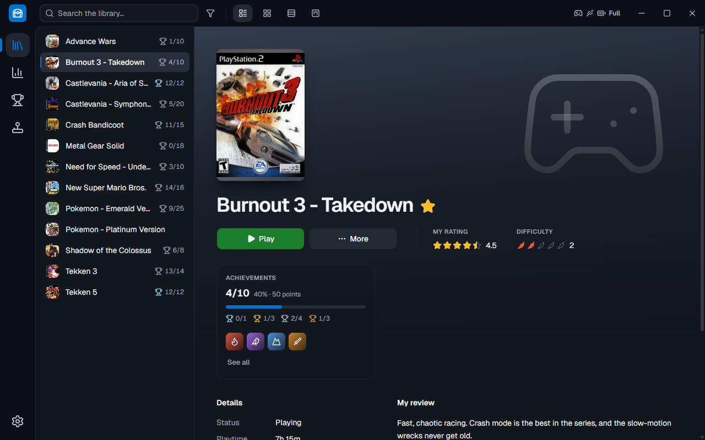
</p>

## About

PC gamers end up with their games scattered everywhere: some on Steam, some on GOG, a few in emulators and others installed in random folders, each with its own launcher. **Playtrove** brings them together in one place, with cover art, details and playtime, ready to launch with one click.

The look follows [Playnite](https://playnite.link/)'s Desktop mode: a dark frame with the tools at the top, an icon menu on the left and your library in the middle. Your library is stored on your own computer, in a local database, with no account and no internet required.

> [!NOTE]
> Playtrove is still being built. For now, games come in through emulators (PCSX2, DuckStation, RetroArch and RPCS3); Steam, GOG and other stores are on the [roadmap](#roadmap).

## Features

- **Emulators**: Playtrove finds PCSX2, DuckStation, RetroArch (with its installed cores) and RPCS3 on its own. Point it to your ROM folders: the emulator, core and console are suggested from the folder name, and games are added with clean names, without "(USA)" and the like.
- **Play**: opens the game in its emulator, with the emulator's own settings, and keeps track of playtime and when you last played. Time recorded by the emulators themselves counts too, so games you started straight from the emulator show up the same way.
- **Metadata and images**: covers come from [libretro-thumbnails](https://thumbnails.libretro.com/) (the same ones RetroArch uses, no key needed) and, when one is missing, from [SteamGridDB](https://www.steamgriddb.com/), which also provides the background art; description, genres, developer, publisher and release date come from [IGDB](https://www.igdb.com/). Both keys are free, and the app explains how to get each one.
- **Details view**: the main library view. Your games are listed on the left, with icons. On the right: the background art, the cover above the title, the **Play** and **More** buttons, the details and the description.
- **Grid view**: covers in a grid that adapts to the window, with the status on a strip under each cover and a details panel when you click a game.
- **Ratings**: from the **More** menu, rate a game (half to five stars) and mark its difficulty in peppers (halves too); in the same menu, write your review. The rating and difficulty appear next to **Play**, and the review above the description.
- **List view**: one row per game, with the name, status, platform, library, playtime, rating, difficulty and achievements.
- **Kanban view**: a board with one column per status (Plan to play, Playing, Beaten, Platinum...), all visible at once. Drag a game to another column to change its status.
- **Custom statuses**, like Playnite's: create, rename, reorder and delete them. There are also two automatic rules: new games go to "Plan to play", and the first time you play a game it moves to "Playing".
- **Achievements**: with your [RetroAchievements](https://retroachievements.org/) account, achievements for emulated games show up as PlayStation-style trophies: bronze, silver and gold (by how hard each achievement is) and platinum for unlocking them all, with how rare each one is (common, rare, very rare and ultra rare). Progress appears in the game list, Grid, List and a card next to the title; the **Achievements** tab brings together a summary, charts by day and by month, your games and your latest unlocks. The app checks the site every 5 minutes and when you close a game, and lets you know when you unlock something new.
- **PS3 trophies**: trophies stored by RPCS3 show up too, no account needed: bronze, silver, gold and platinum, like on the console, with hidden trophies kept hidden until you ask to see them.
- **Statistics**: total playtime and the average per game, your 10 most played, games by status, platform and library, activity over the last 30 days, recently played and never played.
- **Top toolbar**: search (which finds games even without accents), the filters button and the view switcher, always at hand.
- **Filter panel**: on the right, like Playnite. Favorites and Recent are checkboxes. Status, Playtime, Rating, Difficulty, Library, Platform, Genre, Developer, Publisher and Release year are dropdowns where you can pick several options, each showing how many games it has.
- **Favorites**: mark your favorite games from the **More** menu.
- **Connected controller**: with a DualSense connected, the top bar shows whether it's on USB or Bluetooth, its battery level and whether it's charging.
- **Installer and portable version**: install with one click or use the portable .zip, which keeps everything in its own folder. When a new version comes out, the app lets you know and updates with one click.
- **Custom window**: no Windows title bar; minimize, maximize/restore and close are part of the interface.
- **English and Portuguese**: the whole app in both languages. The first time, it follows your Windows language; after that, switch in Settings → General and it changes right away. The built-in statuses are renamed too, and dates and numbers follow each language's format.
- **Dark theme**.

## Screenshots

<table>
  <tr>
    <td width="50%">
      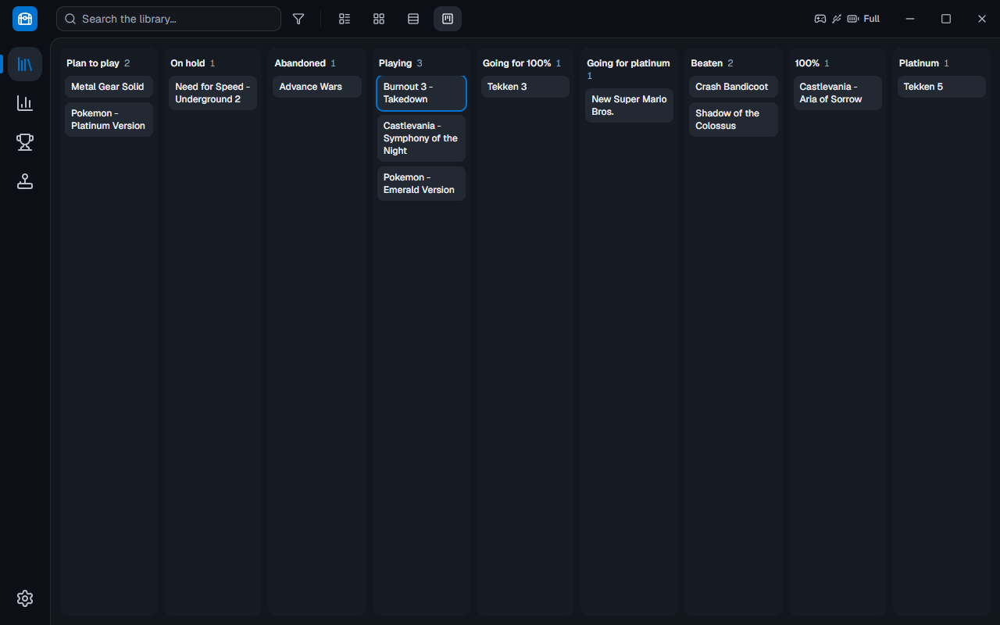
      <p align="center"><sub>Kanban view</sub></p>
    </td>
    <td width="50%">
      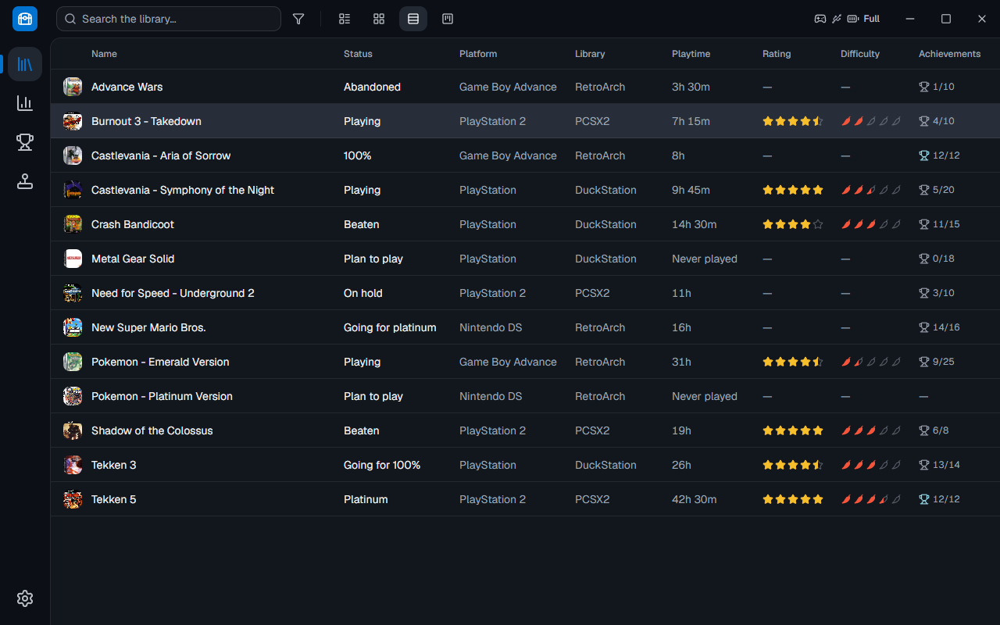
      <p align="center"><sub>List view</sub></p>
    </td>
  </tr>
  <tr>
    <td width="50%">
      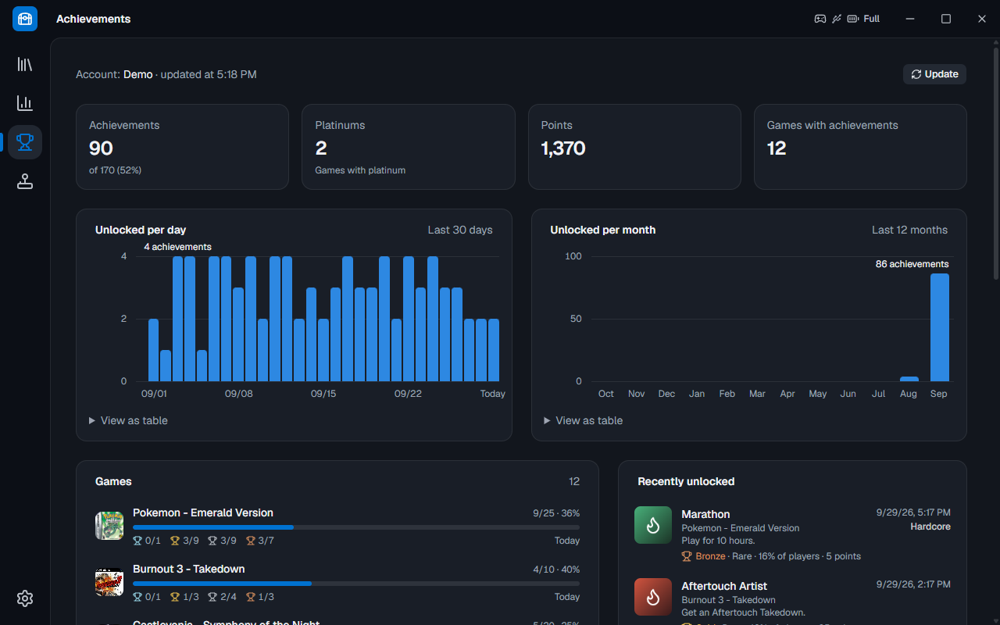
      <p align="center"><sub>Achievements and trophies</sub></p>
    </td>
    <td width="50%">
      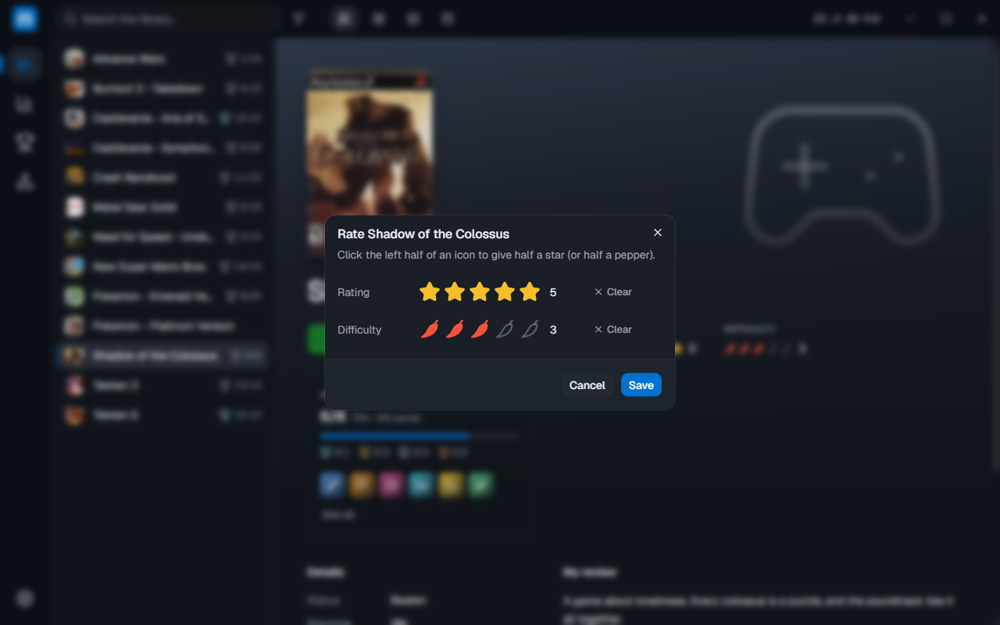
      <p align="center"><sub>Rating a game</sub></p>
    </td>
  </tr>
  <tr>
    <td width="50%">
      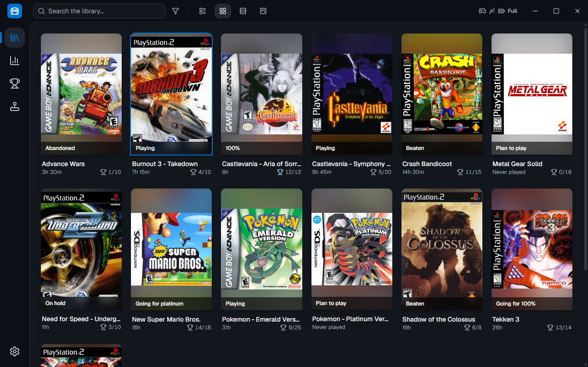
      <p align="center"><sub>Grid view</sub></p>
    </td>
    <td width="50%">
      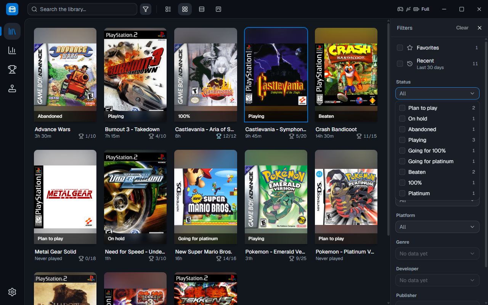
      <p align="center"><sub>Filter panel</sub></p>
    </td>
  </tr>
  <tr>
    <td width="50%">
      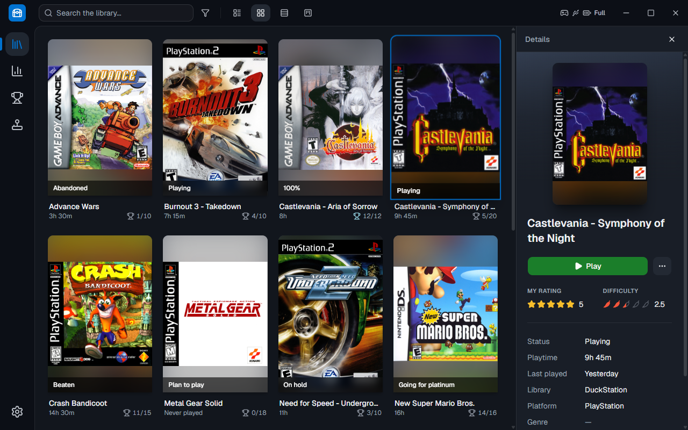
      <p align="center"><sub>Details panel in Grid view</sub></p>
    </td>
    <td width="50%">
      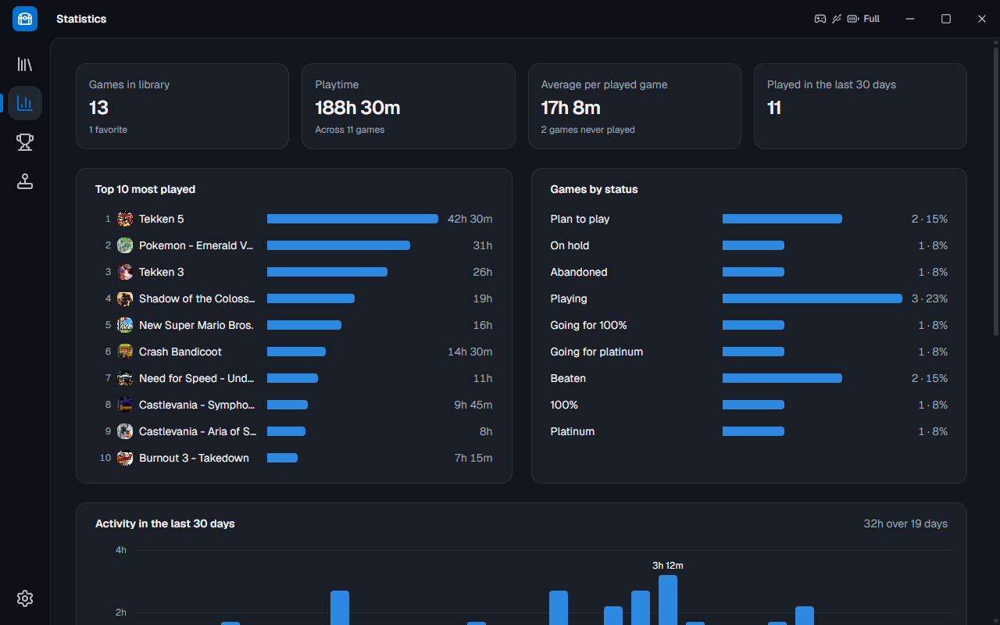
      <p align="center"><sub>Statistics</sub></p>
    </td>
  </tr>
  <tr>
    <td width="50%">
      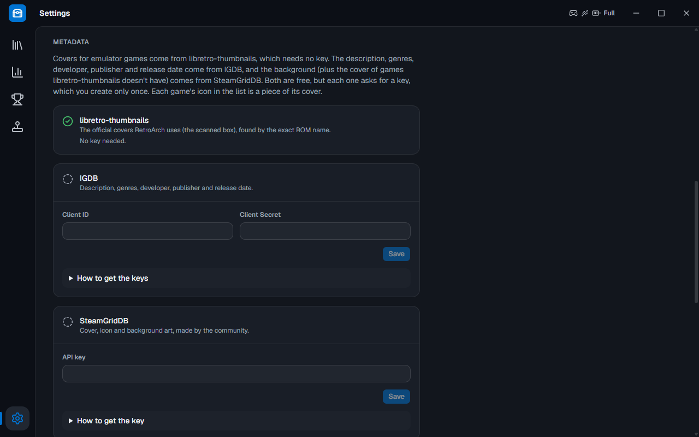
      <p align="center"><sub>Metadata and images</sub></p>
    </td>
    <td width="50%">
      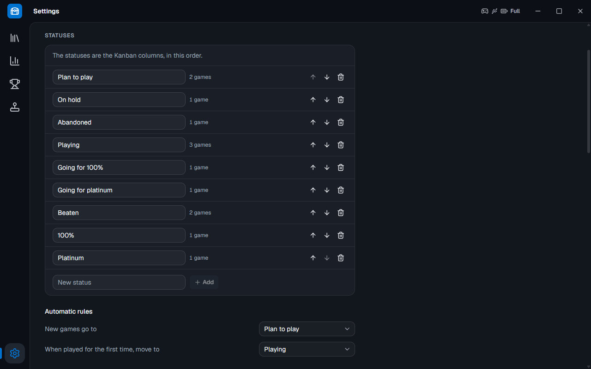
      <p align="center"><sub>Settings → Statuses</sub></p>
    </td>
  </tr>
</table>

## Download

Get the latest version from the [Releases](https://github.com/LamarcKz/Playtrove/releases/latest) page:

- **`Playtrove-Setup-X.Y.Z.exe`**: the installer. It installs just for you, without asking for admin rights, with shortcuts in the Start menu and on the desktop. When a new version comes out, the app lets you know and updates with one click.
- **`Playtrove-X.Y.Z-portable.zip`**: the portable version. Unzip it anywhere and open `Playtrove.exe`: your library stays in the `data` folder next to it.

> [!NOTE]
> Playtrove isn't digitally signed yet, so Windows may show "Windows protected your PC" the first time. Click **More info** and then **Run anyway**.

Each version's changes are on the same page. Version numbers follow [Semantic Versioning](https://semver.org/) (`MAJOR.MINOR.PATCH`).

**Requirements:** Windows 10 or 11, 64-bit.

## Privacy

Playtrove doesn't collect anything about you. Your library, ratings and reviews stay in a database on your computer, and your API keys are encrypted by Windows. The app only goes online to download game metadata and images (IGDB, SteamGridDB and libretro-thumbnails), to read your achievements (RetroAchievements, if you add your account) and to check GitHub for new versions (you can turn that off in Settings → About).

## Bugs and ideas

Found a bug? In the app, go to **Settings → About → Report a problem**: it opens the form on GitHub with your version already filled in. You can also [open an issue](https://github.com/LamarcKz/Playtrove/issues/new/choose) directly, in English or Portuguese. Ideas are welcome too. For security problems, see [SECURITY.md](SECURITY.md).

Pull requests are welcome; please run `npm test` before sending one. The code comments and the developer docs ([ESTRUTURA.md](ESTRUTURA.md)) are written in Portuguese.

## Build from source

You'll need [Node.js](https://nodejs.org/) 22.12 or newer and [Git](https://git-scm.com/). No Visual Studio or C++ compiler required.

```bash
git clone https://github.com/LamarcKz/Playtrove.git
cd Playtrove
npm install
npm run dev
```

`git clone` gets the `main` branch, with the latest stable version. Development happens on the `desenvolvimento` branch: to try what's in progress, run `git switch desenvolvimento` before `npm install`.

| Command | What it does |
|---|---|
| `npm run dev` | Opens the app in development mode, updating on every change. It uses a copy of your installed library (`%APPDATA%\Playtrove Dev`), so code in progress never touches your real games |
| `npm run dev:nova-copia` | Throws that copy away (with the dev app closed); the next `npm run dev` copies your library again |
| `npm run build` | Checks the types and builds the app into `out/` |
| `npm run preview` | Opens the built app |
| `npm run typecheck` | Only checks the TypeScript types |
| `npm test` | Runs all the automated tests: the logic ones and the ones that open the app and click around like a person |
| `npm run dist` | Builds the installer and the portable version into `dist/` |

Want to understand the code? The guide to every folder and file, and where to build each new feature, is in [ESTRUTURA.md](ESTRUTURA.md) (in Portuguese).

## Roadmap

- Import games from Steam, GOG and PC game folders
- More emulators, like Dolphin (GameCube and Wii) and PPSSPP (PSP)
- Edit a game's details and pick another cover
- Remember the view and the filters when the app opens again
- Customization options, like a light theme
- Links to each game's page

## Built with

- [Electron](https://www.electronjs.org/) with [electron-vite](https://electron-vite.org/) and [electron-builder](https://www.electron.build/)
- [React](https://react.dev/) and [TypeScript](https://www.typescriptlang.org/)
- [Tailwind CSS](https://tailwindcss.com/), [shadcn/ui](https://ui.shadcn.com/) and [Lucide](https://lucide.dev/) icons
- [SQLite](https://sqlite.org/) with [better-sqlite3](https://github.com/WiseLibs/better-sqlite3)
- Tests with [Vitest](https://vitest.dev/) and [Playwright](https://playwright.dev/)

## Credits

- The look is inspired by [Playnite](https://playnite.link/), an independent project with no connection to this one.
- The icons come from [Lucide](https://lucide.dev/) (ISC license).
- Game metadata comes from [IGDB](https://www.igdb.com/) (by Twitch); covers from [libretro-thumbnails](https://thumbnails.libretro.com/), the [RetroArch](https://www.retroarch.com/) community's collection; and background art (and any missing covers) from [SteamGridDB](https://www.steamgriddb.com/), made by its community.
- Achievements come from [RetroAchievements](https://retroachievements.org/), a community project with no connection to this one.
- Game, console and service names belong to their owners. PlayStation and DualSense are trademarks of Sony Interactive Entertainment; Playtrove isn't affiliated with Sony or with any of the services above.

## License

Playtrove is free software under the [MIT License](LICENSE).
