<p align="center">
  <a href="README.md">English</a> · <b>Português</b>
</p>

<p align="center">
  
</p>

<h1 align="center">Playtrove</h1>

<p align="center">
  <strong>Todos os seus jogos de PC em uma biblioteca só.</strong><br>
  Gerenciador de biblioteca de jogos para Windows, inspirado no Playnite.
</p>

<p align="center">
  
  
  
  
  
  
  
</p>

<p align="center">
  <a href="#sobre-o-projeto">Sobre</a> ·
  <a href="#recursos">Recursos</a> ·
  <a href="#capturas-de-tela">Capturas de tela</a> ·
  <a href="#download">Download</a> ·
  <a href="#como-compilar">Como compilar</a> ·
  <a href="#roadmap">Roadmap</a>
</p>

<p align="center">
  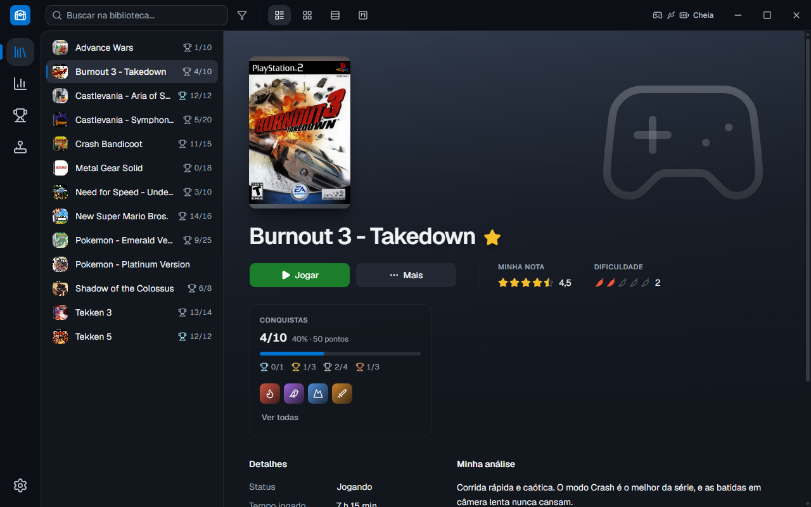
</p>

## Sobre o projeto

Quem joga no PC acaba com os jogos espalhados: parte na Steam, parte na GOG, alguns em emuladores e outros instalados em pastas avulsas, cada um com seu próprio launcher. O **Playtrove** reúne tudo em uma interface só: todos os jogos do computador no mesmo lugar, com capa, informações e tempo jogado, prontos para abrir com um clique.

O visual segue a linha do [Playnite](https://playnite.link/) no modo Desktop: uma moldura escura com as ferramentas no topo, um menu de ícones à esquerda e a biblioteca no centro. A biblioteca fica guardada no próprio computador, em um banco de dados local, sem conta e sem depender de internet.

> [!NOTE]
> O projeto ainda está em construção. Por enquanto, os jogos entram pelos emuladores (PCSX2, DuckStation, RetroArch e RPCS3); Steam, GOG e outras lojas estão no [roadmap](#roadmap).

## Recursos

- **Emuladores**: o app encontra sozinho o PCSX2, o DuckStation, o RetroArch (com os cores instalados) e o RPCS3. Basta apontar as pastas de ROMs: o emulador, o core e o console são sugeridos pelo nome da pasta, e os jogos entram na biblioteca com o nome limpo, sem "(USA)" e afins.
- **Jogar**: abre o jogo no emulador, com as configurações dele, e conta sozinho o tempo jogado e a última vez jogado. O tempo que os próprios emuladores registram também entra na biblioteca, então o que foi jogado abrindo o emulador direto aparece do mesmo jeito.
- **Metadados e imagens**: a capa vem do [libretro-thumbnails](https://thumbnails.libretro.com/) (a mesma do RetroArch, sem precisar de chave) e, quando falta, do [SteamGridDB](https://www.steamgriddb.com/), que também dá a arte de fundo; a descrição, os gêneros, a desenvolvedora, a publicadora e a data de lançamento vêm do [IGDB](https://www.igdb.com/). As duas chaves são gratuitas, e o app explica como criar cada uma.
- **Modo Detalhes**: a visão principal da biblioteca. À esquerda fica a lista de jogos, com os ícones. À direita aparecem a arte de fundo, a capa acima do título, os botões **Jogar** e **Mais**, os detalhes e a descrição.
- **Modo Grade**: as capas em uma grade que se ajusta ao tamanho da janela, com o status numa faixa embaixo de cada capa e um painel lateral de detalhes ao clicar em um jogo.
- **Avaliação**: pelo menu **Mais**, dê a sua nota (de meia a cinco estrelas) e marque a dificuldade em pimentas (também com meia); no mesmo menu, escreva a sua análise do jogo. A nota e a dificuldade aparecem ao lado do botão **Jogar**, e a análise, em cima da descrição.
- **Modo Lista**: uma linha por jogo, com o nome, o status, a plataforma, a biblioteca, o tempo jogado, a nota, a dificuldade e as conquistas.
- **Modo Kanban**: um quadro com uma coluna para cada status (Planejo jogar, Jogando, Zerado, Platinado...), todas visíveis de uma vez. Para mudar o status de um jogo, é só arrastá-lo para outra coluna.
- **Status personalizáveis**, como os do Playnite: dá para criar, renomear, mudar a ordem e apagar os status. Também há duas regras automáticas: jogo novo entra em "Planejo jogar" e, na primeira vez que é jogado, vai para "Jogando".
- **Conquistas**: com a sua conta do [RetroAchievements](https://retroachievements.org/), as conquistas dos jogos de emulador aparecem na biblioteca como troféus do PlayStation: bronze, prata e ouro (pela dificuldade de cada conquista) e a platina para quem desbloqueia todas, com a raridade de cada uma (comum, rara, muito rara e ultrarrara). O progresso aparece na lista de jogos, na Grade, no modo Lista e num cartão ao lado do título; a aba **Conquistas** junta o resumo, os gráficos por dia e por mês, os jogos e as desbloqueadas por último. O app confere o site a cada 5 minutos e ao fechar um jogo, e avisa quando aparece uma conquista nova.
- **Troféus do PS3**: os troféus que o RPCS3 guarda também aparecem, sem precisar de conta: bronze, prata, ouro e platina, como no console, com os troféus ocultos escondidos até você pedir para ver.
- **Estatísticas**: tempo jogado total e a média por jogo, os 10 mais jogados, os jogos por status, por plataforma e por biblioteca, a atividade dos últimos 30 dias, os jogados por último e os nunca jogados.
- **Barra de ferramentas no topo**: a busca (que acha o jogo mesmo sem acentos), o botão de filtros e a troca entre os modos de exibição ficam sempre à mão.
- **Painel de filtros**: na direita, como no Playnite. Favoritos e Recentes ficam em caixinhas. Status, Tempo jogado, Nota, Dificuldade, Biblioteca, Plataforma, Gênero, Desenvolvedora, Publicadora e Ano de lançamento são seletores em que dá para marcar várias opções, e cada opção mostra quantos jogos ela tem.
- **Favoritos**: marque os jogos preferidos pelo menu **Mais**.
- **Controle conectado**: com um DualSense ligado, a barra do topo mostra se ele está no USB ou no Bluetooth, quanto de bateria ele tem e se está carregando.
- **Instalador e versão portátil**: instale com um clique ou use o .zip portátil, que guarda tudo na própria pasta. Quando sai uma versão nova, o app avisa e se atualiza com um clique.
- **Janela própria**: sem a barra do Windows, com os botões minimizar, maximizar/restaurar e fechar integrados à interface.
- **Português e inglês**: o app inteiro nos dois idiomas. Na primeira vez, ele segue o idioma do Windows; depois, é só trocar em Configurações → Geral, e a troca vale na hora. Os status que vêm com o app mudam de nome junto, e as datas e os números seguem o formato de cada idioma.
- **Tema escuro**.

## Capturas de tela

<table>
  <tr>
    <td width="50%">
      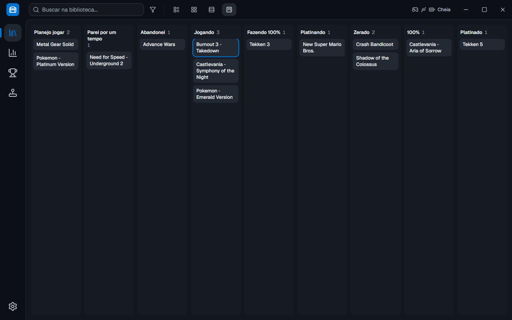
      <p align="center"><sub>Modo Kanban</sub></p>
    </td>
    <td width="50%">
      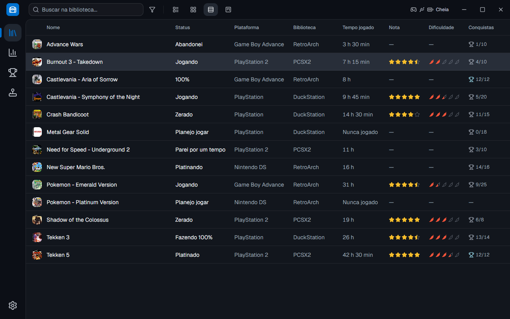
      <p align="center"><sub>Modo Lista</sub></p>
    </td>
  </tr>
  <tr>
    <td width="50%">
      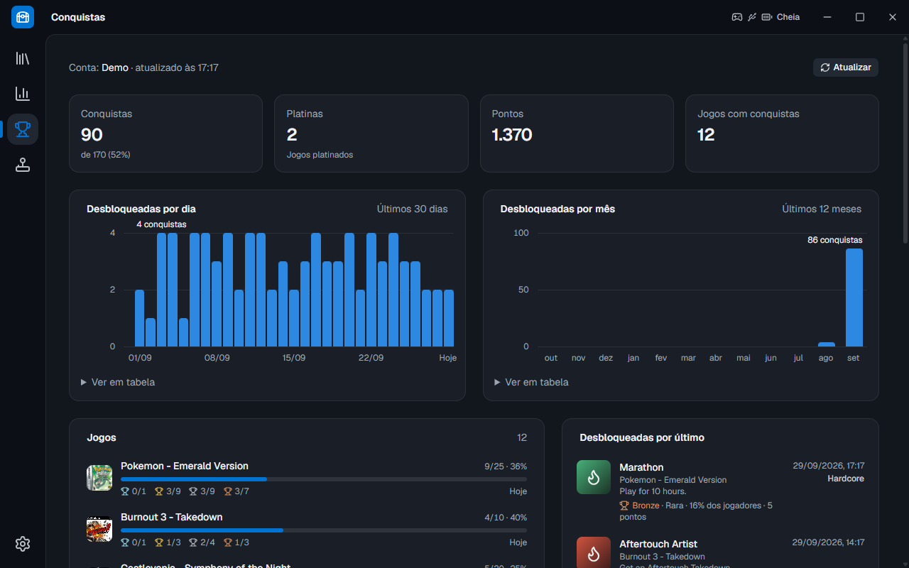
      <p align="center"><sub>Conquistas e troféus</sub></p>
    </td>
    <td width="50%">
      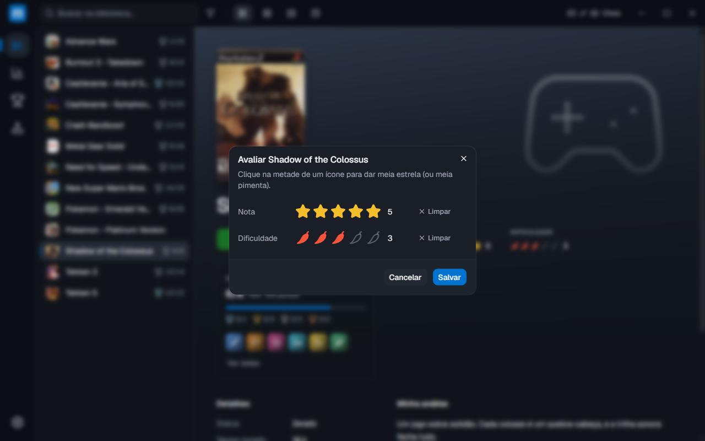
      <p align="center"><sub>Avaliação do jogo</sub></p>
    </td>
  </tr>
  <tr>
    <td width="50%">
      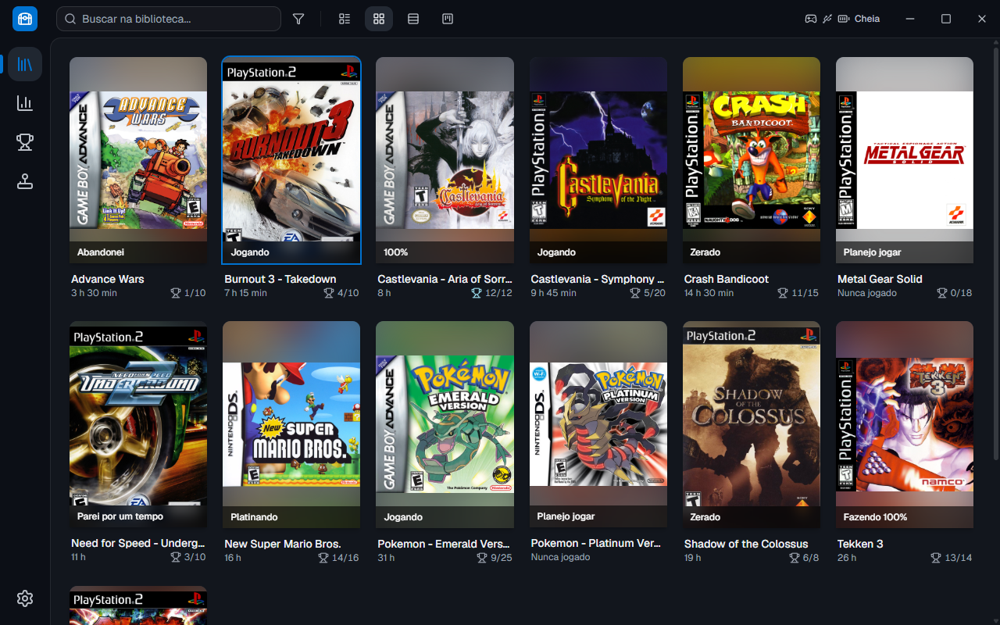
      <p align="center"><sub>Modo Grade</sub></p>
    </td>
    <td width="50%">
      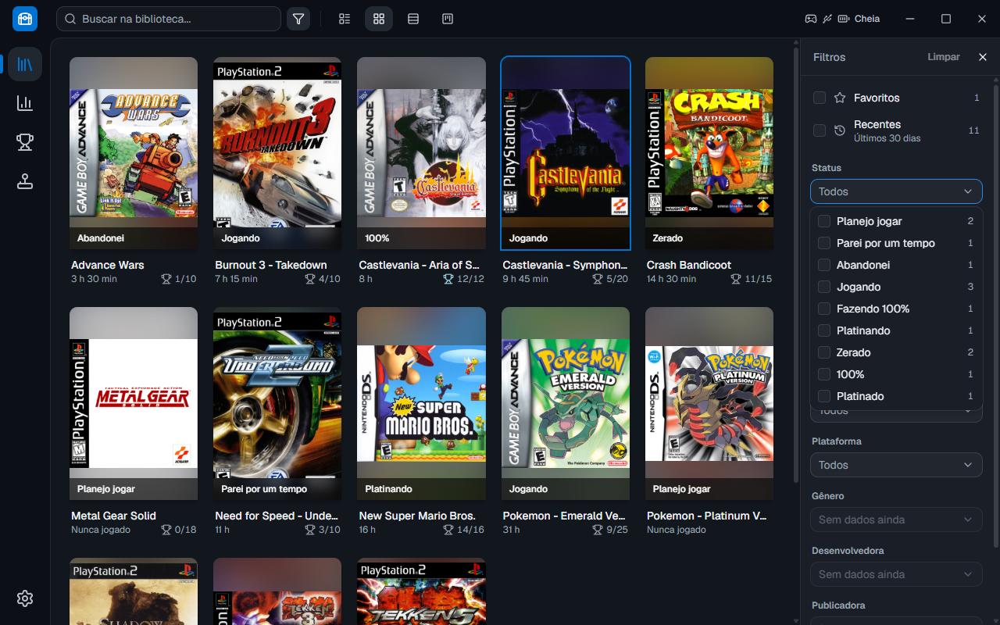
      <p align="center"><sub>Painel de filtros</sub></p>
    </td>
  </tr>
  <tr>
    <td width="50%">
      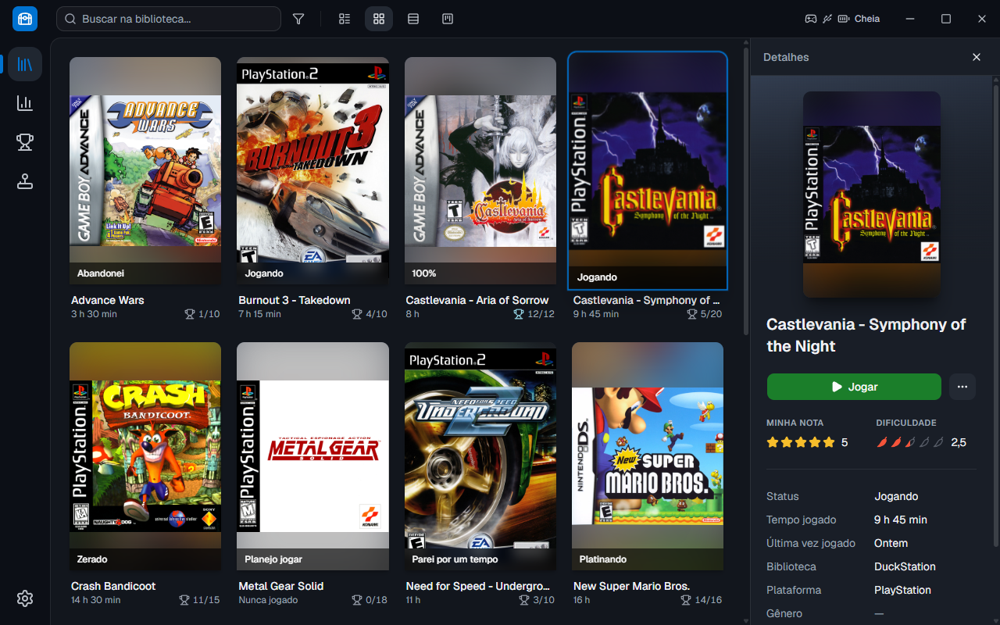
      <p align="center"><sub>Painel de detalhes no modo Grade</sub></p>
    </td>
    <td width="50%">
      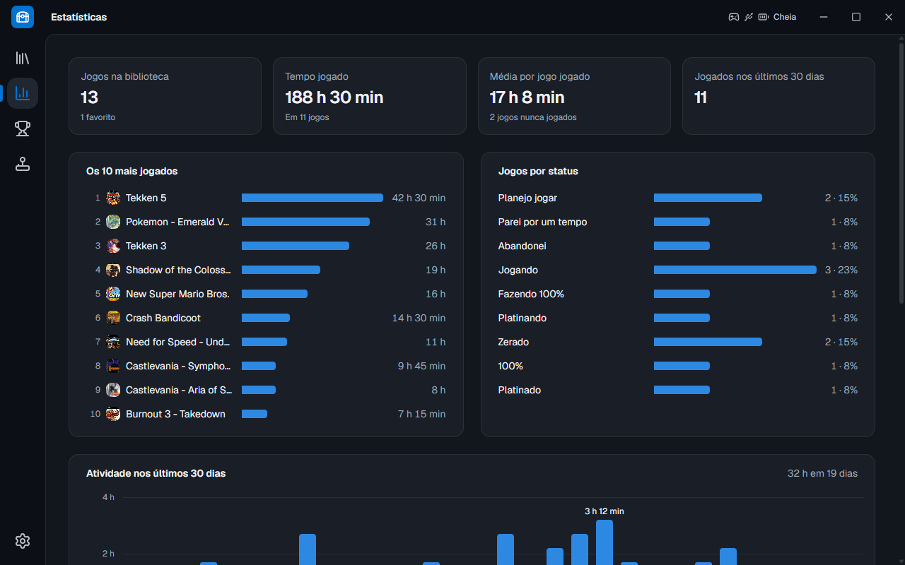
      <p align="center"><sub>Estatísticas</sub></p>
    </td>
  </tr>
  <tr>
    <td width="50%">
      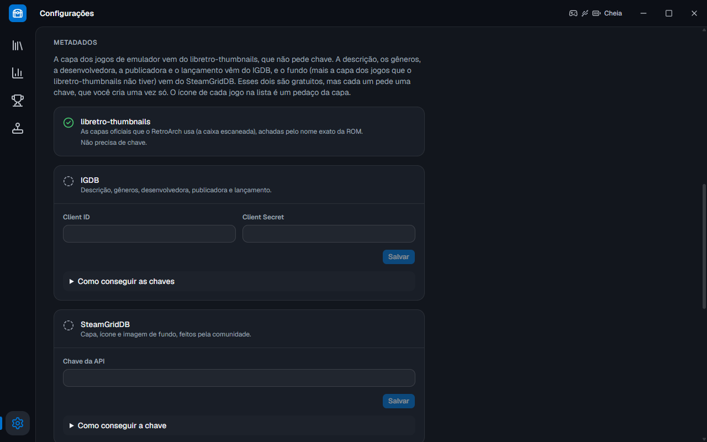
      <p align="center"><sub>Metadados e imagens</sub></p>
    </td>
    <td width="50%">
      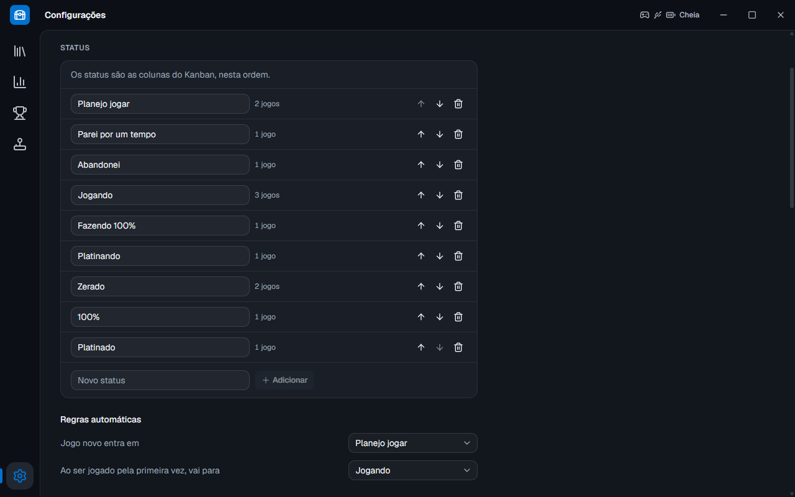
      <p align="center"><sub>Configurações → Status</sub></p>
    </td>
  </tr>
</table>

## Download

Baixe a versão mais recente na página de [Releases](https://github.com/LamarcKz/Playtrove/releases/latest):

- **`Playtrove-Setup-X.Y.Z.exe`**: o instalador. Instala só para você, sem pedir administrador, com atalhos no menu Iniciar e na Área de Trabalho. Quando sai uma versão nova, o app avisa e se atualiza com um clique.
- **`Playtrove-X.Y.Z-portable.zip`**: a versão portátil. Descompacte onde quiser e abra o `Playtrove.exe`: a biblioteca fica na pasta `data`, ao lado dele.

> [!NOTE]
> O app ainda não tem assinatura digital, então o Windows pode mostrar "O Windows protegeu o computador" na primeira vez. Clique em **Mais informações** e depois em **Executar assim mesmo**.

As novidades de cada versão ficam na mesma página. Os números seguem o [Versionamento Semântico](https://semver.org/lang/pt-BR/) (`MAIOR.MENOR.CORREÇÃO`).

**Requisitos:** Windows 10 ou 11, 64 bits.

## Privacidade

O Playtrove não coleta nada sobre você. A biblioteca, as notas e as análises ficam num banco de dados no seu computador, e as chaves das APIs são trancadas pelo Windows. O app só usa a internet para baixar os metadados e as imagens dos jogos (IGDB, SteamGridDB e libretro-thumbnails), para ler as suas conquistas (RetroAchievements, se você colocar a sua conta) e para conferir no GitHub se há versão nova (dá para desligar em Configurações → Sobre).

## Bugs e ideias

Achou um bug? No app, vá em **Configurações → Sobre → Reportar um problema**: ele abre o formulário no GitHub com a sua versão já preenchida. Também dá para [abrir uma issue](https://github.com/LamarcKz/Playtrove/issues/new/choose) direto, em português ou em inglês. Ideias também são bem-vindas. Para problemas de segurança, veja o [SECURITY.md](SECURITY.md).

Pull requests são bem-vindos; rode o `npm test` antes de mandar.

## Como compilar

Você vai precisar do [Node.js](https://nodejs.org/) 22.12 ou mais novo e do [Git](https://git-scm.com/). Não é preciso Visual Studio nem compilador C++.

```bash
git clone https://github.com/LamarcKz/Playtrove.git
cd Playtrove
npm install
npm run dev
```

O `git clone` traz a branch `main`, com a última versão estável. O desenvolvimento acontece na branch `desenvolvimento`: para testar o que está em andamento, rode `git switch desenvolvimento` antes do `npm install`.

| Comando | O que faz |
|---|---|
| `npm run dev` | Abre o app em modo de desenvolvimento, atualizando sozinho a cada alteração. Ele usa uma cópia da biblioteca do app instalado (`%APPDATA%\Playtrove Dev`), para o código em teste nunca mexer nos seus jogos de verdade |
| `npm run dev:nova-copia` | Joga essa cópia fora (com o app do dev fechado); o próximo `npm run dev` copia a biblioteca de novo |
| `npm run build` | Confere os tipos e gera o app compilado em `out/` |
| `npm run preview` | Abre a versão compilada |
| `npm run typecheck` | Só confere os tipos do TypeScript |
| `npm test` | Roda todos os testes automáticos: os da lógica e os que abrem o app e clicam como uma pessoa |
| `npm run dist` | Gera o instalador e a versão portátil em `dist/` |

Quer entender o código? O guia com o que cada pasta e arquivo faz, e onde implementar cada funcionalidade, está em [ESTRUTURA.md](ESTRUTURA.md).

## Roadmap

- Importação de jogos da Steam, da GOG e de pastas de jogos do computador
- Mais emuladores, como o Dolphin (GameCube e Wii) e o PPSSPP (PSP)
- Editar as informações de um jogo e escolher outra capa
- Lembrar o modo de exibição e os filtros ao abrir o app de novo
- Opções de personalização, como o tema claro
- Links para a página de cada jogo

## Tecnologias

- [Electron](https://www.electronjs.org/) com [electron-vite](https://electron-vite.org/) e [electron-builder](https://www.electron.build/)
- [React](https://react.dev/) e [TypeScript](https://www.typescriptlang.org/)
- [Tailwind CSS](https://tailwindcss.com/), [shadcn/ui](https://ui.shadcn.com/) e ícones [Lucide](https://lucide.dev/)
- [SQLite](https://sqlite.org/) com [better-sqlite3](https://github.com/WiseLibs/better-sqlite3)
- Testes com [Vitest](https://vitest.dev/) e [Playwright](https://playwright.dev/)

## Créditos

- O visual é inspirado no [Playnite](https://playnite.link/), um projeto independente, sem ligação com este.
- Os ícones vêm do [Lucide](https://lucide.dev/) (licença ISC).
- Os metadados dos jogos vêm do [IGDB](https://www.igdb.com/) (da Twitch); as capas, do [libretro-thumbnails](https://thumbnails.libretro.com/), o acervo da comunidade do [RetroArch](https://www.retroarch.com/); e as artes de fundo (e as capas que faltarem), do [SteamGridDB](https://www.steamgriddb.com/), feitas pela comunidade.
- As conquistas vêm do [RetroAchievements](https://retroachievements.org/), um projeto da comunidade, sem ligação com este.
- Os nomes de jogos, consoles e serviços pertencem aos seus donos. PlayStation e DualSense são marcas da Sony Interactive Entertainment; o Playtrove não tem ligação com a Sony nem com os serviços acima.

## Licença

O Playtrove é software livre, com a [licença MIT](LICENSE).
